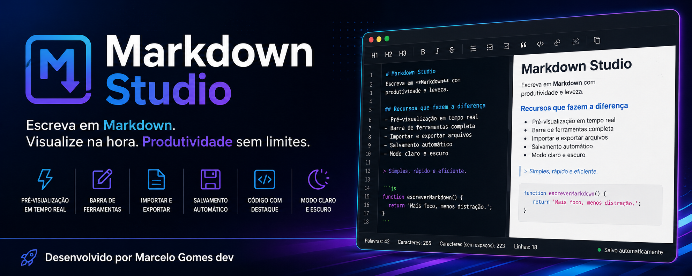
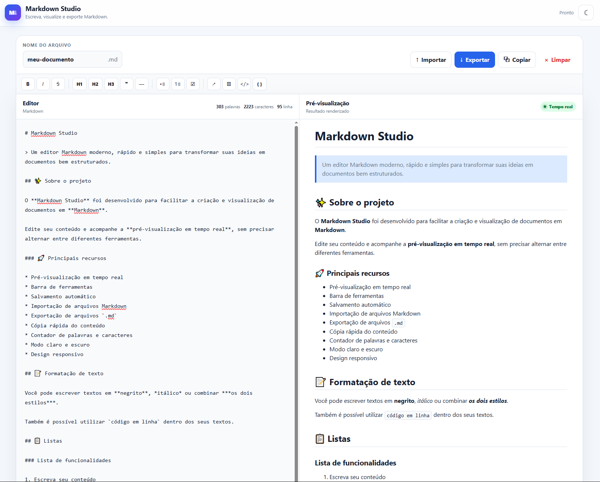
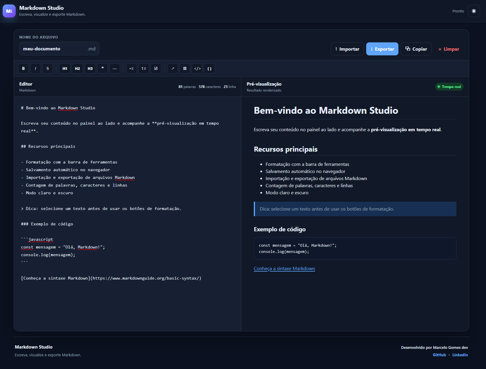

<div align="center">



# Markdown Studio

### Editor Markdown moderno com pré-visualização em tempo real

Editor Markdown responsivo desenvolvido para criar, editar e visualizar documentos diretamente no navegador, com ferramentas de formatação, salvamento automático e suporte aos modos claro e escuro.

</div>

---

## 🚀 Sobre o projeto

O **Markdown Studio** é uma aplicação web desenvolvida para tornar a criação de documentos Markdown mais simples e produtiva.

A aplicação permite escrever e formatar conteúdos enquanto acompanha o resultado instantaneamente através da **pré-visualização em tempo real**.

Todo o projeto funciona diretamente no navegador, utilizando **HTML, CSS e JavaScript**, sem necessidade de cadastro ou servidor próprio.

---

---

## 🖥️ Interface

### ☀️ Modo claro



### 🌙 Modo escuro



---

## ✨ Funcionalidades

* ✍️ Editor Markdown com pré-visualização em tempo real
* 🛠️ Barra de ferramentas para formatação
* 📰 Títulos, negrito, itálico e tachado
* 📋 Listas simples, numeradas e listas de tarefas
* 🔗 Inserção de links e imagens
* 💬 Citações e linhas horizontais
* 💻 Código em linha e blocos de código
* ↩️ Continuação automática de listas
* 📊 Contador de palavras, caracteres e linhas
* 💾 Salvamento automático com LocalStorage
* 📂 Importação de arquivos `.md`, `.markdown` e `.txt`
* 📥 Exportação de documentos em `.md`
* 📋 Cópia do conteúdo para a área de transferência
* 📝 Nome de arquivo personalizável
* ☀️ Modo claro
* 🌙 Modo escuro
* ⌨️ Atalhos de teclado
* 📱 Interface responsiva
* ♿ Recursos básicos de acessibilidade
* 🛡️ Sanitização segura do HTML renderizado

---

## 🛠️ Tecnologias utilizadas

| Tecnologia           | Utilização                        |
| -------------------- | --------------------------------- |
| **HTML5**            | Estrutura da aplicação            |
| **CSS3**             | Interface, temas e responsividade |
| **JavaScript**       | Lógica e interatividade           |
| **Marked**           | Interpretação do Markdown         |
| **DOMPurify**        | Sanitização do HTML               |
| **LocalStorage API** | Salvamento automático             |
| **Clipboard API**    | Cópia de conteúdo                 |
| **File API**         | Importação de arquivos            |

As bibliotecas **Marked** e **DOMPurify** são carregadas via CDN e utilizadas para interpretação e sanitização segura do conteúdo Markdown.

---

## 📁 Estrutura do projeto

```text
markdown-studio/
│
├── assets/
│   └── favicon.svg
│
├── images/
│   ├── banner.png
│   ├── modo-claro.png
│   └── modo-escuro.png
│
├── index.html
├── styles.css
├── script.js
├── README.md
├── LICENSE
└── .gitignore
```

---

## ⌨️ Atalhos

| Atalho         | Ação                           |
| -------------- | ------------------------------ |
| `Ctrl/Cmd + S` | Exportar Markdown              |
| `Ctrl/Cmd + B` | Aplicar negrito                |
| `Ctrl/Cmd + I` | Aplicar itálico                |
| `Ctrl/Cmd + K` | Inserir link                   |
| `Tab`          | Inserir dois espaços no editor |

---

## 💻 Como executar localmente

1. Baixe ou clone este repositório.
2. Abra a pasta do projeto no **Visual Studio Code**.
3. Execute utilizando a extensão **Live Server** ou outro servidor HTTP local.
4. Abra o endereço fornecido pelo servidor no navegador.

Também é possível executar o projeto abrindo diretamente o arquivo `index.html`.

---

## 🌐 Publicação no GitHub Pages

1. Crie um repositório no GitHub.
2. Envie todos os arquivos mantendo a estrutura original.
3. Acesse **Settings → Pages**.
4. Em **Build and deployment**, selecione **Deploy from a branch**.
5. Escolha a branch `main`.
6. Selecione `/ (root)`.
7. Clique em **Save**.
8. Aguarde o GitHub finalizar a publicação.

---

## 🔒 Segurança e privacidade

O conteúdo criado no Markdown Studio permanece armazenado localmente através do **LocalStorage do navegador**.

Nenhum documento é enviado para um servidor próprio.

Antes da exibição na pré-visualização, o HTML gerado a partir do Markdown é sanitizado utilizando **DOMPurify**, reduzindo riscos relacionados à inserção de conteúdo HTML malicioso.

---

## 📄 Licença

Este projeto está distribuído sob a licença **MIT**.

Consulte o arquivo [LICENSE](LICENSE) para mais informações.

---

<div align="center">

### 👨‍💻 Desenvolvido por Marcelo Gomes dev

[](https://github.com/marcelogomesdev)
[](https://www.linkedin.com/in/marcelogomesdev/)

</div>
